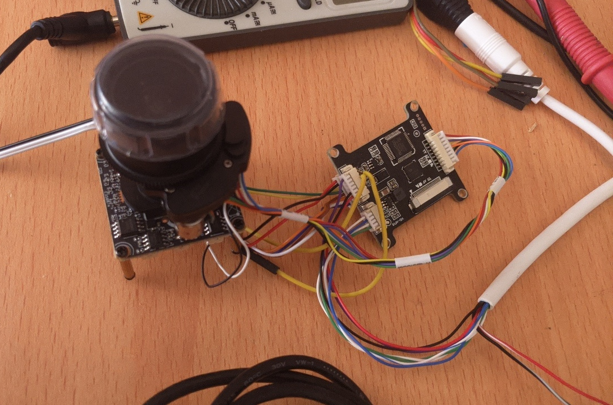

# ivg-g3s with zoom lens

The camera has Gk7205V210 [datasheet](./datasheets/GK7205V210_Datasheet.pdf) with IMX307LQR image sensor. 

# Dauterboard
There is a dauter board  with passthour ethernet data with:
- MCU Nuvoton-Tech NUC029LAN [datasheet](./datasheets/Nuvoton-Tech-NUC029LAN_C94618.pdf)
- Motor MS41929 controller [datasheet](./datasheets/MS41929.pdf)
It communicates with the main camera CPU via UART.

# Install openIPC
Follow the guides:
- [unlock bootloader](https://github.com/OpenIPC/burn?tab=readme-ov-file#unlock-flash-on-gk7205v200-and-gk7205v210)
- [Using Burn](https://github.com/OpenIPC/wiki/blob/66554dc46bb611f89616acabba3bf50bfe9788dd/en/burn-example.md)
- [Download firmware](https://openipc.org/cameras/vendors/goke/socs/gk7205v210)