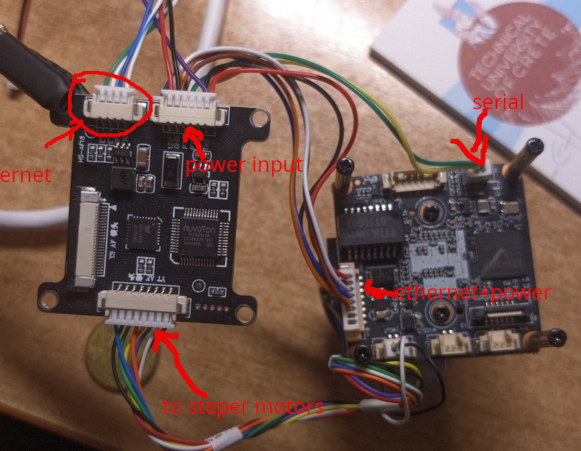

# IVG-G3S  with zoom lens

The camera has Gk7205V210 [datasheet](./datasheets/GK7205V210_Datasheet.pdf) with IMX307LQR image sensor. 

The lens __propable__ is a YT30021 ([pdf](https://www.silicondevice.com/file.upload/images/Gid1573Pdf_YTOT%20catalogue%202018.12.pdf)). 

It consumers about 120mA@12V. The 2 motors for zoom/focus are worm to the touch after 2min of operation.

# Dauterboard
There is a dauter board  with passthour ethernet data with:
- MCU Nuvoton-Tech NUC029LAN [datasheet](./datasheets/Nuvoton-Tech-NUC029LAN_C94618.pdf)
- Motor MS41929 controller [datasheet](./datasheets/MS41929.pdf)

After a reverse image search i found the module manufacturer: [FSAN 38*38mm Motorized Zoom Lens IP Camera Module PCB Control Board](https://www.alibaba.com/product-detail/FSAN-38-38mm-Motorized-Zoom-Lens_1600387513614.html)

It communicates with the main camera CPU via UART/serial.

# Install openIPC
Follow the guides:
- [unlock bootloader](https://github.com/OpenIPC/burn?tab=readme-ov-file#unlock-flash-on-gk7205v200-and-gk7205v210)
- [Using Burn](https://github.com/OpenIPC/wiki/blob/66554dc46bb611f89616acabba3bf50bfe9788dd/en/burn-example.md)
- [Download firmware](https://openipc.org/cameras/vendors/goke/socs/gk7205v210)

Initial i had trouble unloacking the bootloader with Burn [see log](./logs/problem_burn.log). I used another computer and try again. These time it worked.

# Log files
There is a serial communication when the camera boots to reset and set zoom and focus of the lens.
The communication is uninderupted the entire time that the camera is powered.
I use hex encoding @115200 to generate the some files using cutecom.

- [boot of the camera](./logs/bootOutput.log). After Starting kernel ... the serial communication with the lens start
- [boot of the camera with hex](./logs/bootOutput_hex.log)
- [output_zoom](./logs/output_zoom.log)
- [output_focus](./logs/output_focus.log)
- [output_zoom_focus](./output_zoom_focus.log)
- [output_zoom_focus_onlyHex](./logs/output_zoom_focus_onlyHex.log)

## PTZ Protocols

https://github.com/OpenIPC/wiki/blob/82c5e6d1f05edf928b24b7d099f65e45d04ce4e6/ru/resources.md?plain=1#L52

different scripts to test PTZ Protocols without any success
- pelcoD: logs/zoom_in.sh, logs/pelcoD.py
- VISCA: logs/VISCA.py
- BiCom: logs/BiCom.py
- hitachi: logs/hitachi.py

